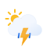

<a name="readme-top"></a>

[![MIT License][license-shield]][license-url]

<!-- PROJECT LOGO -->
<br />
<div align="center">
  <a href="https://github.com/daniel-citrus/weather-app">
    
  </a>

  <h3 align="center">Weather Forecast</h3>

  <p align="center">
    <a href="https://github.com/daniel-citrus/weather-app"><strong>Explore the docs »</strong></a>
    <br />
    <a href="https://weatherforteller.netlify.app/">View Demo</a>
    ·
    <a href="https://github.com/daniel-citrus/weather-app/issues">Recommend Feature</a>
  </p>
</div>

<!-- TABLE OF CONTENTS -->
<details>
  <summary>Table of Contents</summary>
  <ol>
    <li>
      <a href="#about-the-project">About The Project</a>
      <ul>
        <li><a href="#built-with">Built With</a></li>
      </ul>
    </li>
    <li>
      <a href="#getting-started">Getting Started</a>
      <ul>
        <li><a href="#prerequisites">Prerequisites</a></li>
        <li><a href="#installation">Installation</a></li>
      </ul>
    </li>
    <li><a href="#roadmap">Roadmap</a></li>
    <li><a href="#license">License</a></li>
    <li><a href="#contact">Contact</a></li>
    <li><a href="#acknowledgments">Acknowledgments</a></li>
  </ol>
</details>

<!-- ABOUT THE PROJECT -->
## About The Project

[![Weather Forecast][product-screenshot]](https://weatherforteller.netlify.app/)

Weather Forecasting application that displays a 3-day forecast of a desired location. Demonstrates the use of asynchronous functions and promises to gather and display weather data.

<p align="right">(<a href="#readme-top">back to top</a>)</p>

### Built With
* [![HTML5][html5-shield]][html5-url]
* [![Sass][sass-shield]][sass-url]
* [![Javascript][javascript-shield]][javascript-url]
* [![Webpack][webpack-shield]][webpack-url]

<p align="right">(<a href="#readme-top">back to top</a>)</p>

<!-- GETTING STARTED -->
## Getting Started
### Prerequisites

* npm
  ```sh
  npm install npm@latest -g
  ```

### Installation

1. Get a free API Key at [www.weatherapi.com](https://www.weatherapi.com/)
2. Clone the repo
   ```sh
   git clone https://github.com/daniel-citrus/weather-app.git
   ```
3. Install NPM packages
   ```sh
   npm install
   ```
4. Enter your API in `src/scripts/weather.js`
   ```js
   const API_KEY = 'ENTER YOUR API';
   ```

<p align="right">(<a href="#readme-top">back to top</a>)</p>

<!-- ROADMAP -->
## Roadmap

* [x] API Request
  * [x] get user coordinates
  * [x] get data
  * [x] parse data
* [x] Design
  * [x] Current weather
  * [x] Weather trend for the day
  * [x] High and low for the next 2 days
  * [x] Display gif/image related to the current weather
  * [x] F and C switcher

See the [open issues](https://github.com/daniel-citrus/weather-app/issues) for a full list of proposed features (and known issues).

<p align="right">(<a href="#readme-top">back to top</a>)</p>

<!-- LICENSE -->
## License
Distributed under the MIT License. See `LICENSE.txt` for more information.
<p align="right">(<a href="#readme-top">back to top</a>)</p>

<!-- ACKNOWLEDGMENTS -->
## Acknowledgments

* [The Odin Project](https://www.theodinproject.com/lessons/node-path-javascript-weather-app)
* [Weather API](https://www.weatherapi.com/)
* [Best README Template](https://github.com/othneildrew/Best-README-Template)
* [Img Shields](https://shields.io)

<p align="right">(<a href="#readme-top">back to top</a>)</p>

<!-- MARKDOWN LINKS & IMAGES -->
<!-- https://www.markdownguide.org/basic-syntax/#reference-style-links -->
[license-shield]: https://img.shields.io/github/license/othneildrew/Best-README-Template.svg?style=for-the-badge
[license-url]: https://github.com/othneildrew/Best-README-Template/blob/master/LICENSE.txt
[product-screenshot]: ./src/style/app%20screenshot.png
[html5-shield]: https://img.shields.io/badge/HTML5-%23222222?style=for-the-badge&logo=html5&logoColor=%23E34F26
[html5-url]: https://html.spec.whatwg.org/
[sass-shield]: https://img.shields.io/badge/SASS-%23CC6699?style=for-the-badge&logo=sass&logoColor=white
[sass-url]: https://sass-lang.com/
[webpack-shield]: https://img.shields.io/badge/Webpack-%238DD6F9?style=for-the-badge&logo=webpack&logoColor=white
[webpack-url]: https://webpack.js.org/
[javascript-shield]: https://img.shields.io/badge/Javascript-%232e302c?style=for-the-badge&logo=javascript&logoColor=%23F7DF1E
[javascript-url]: https://developer.mozilla.org/en-US/docs/Web/JavaScript